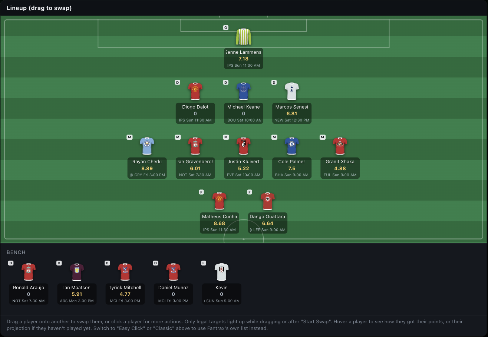
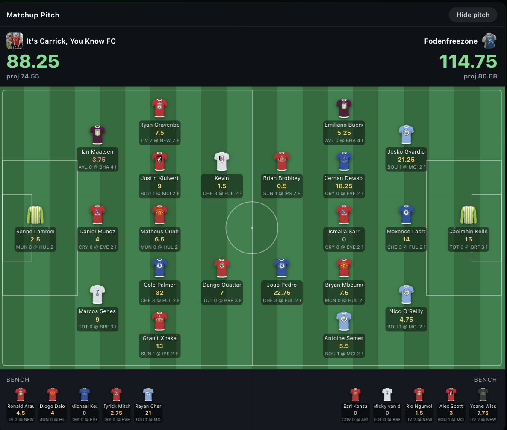
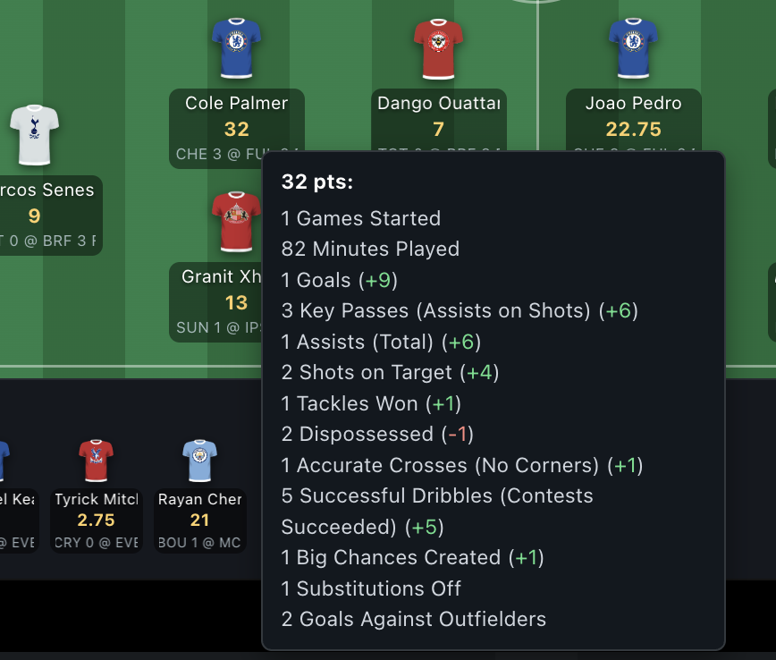

# Prettier Fantrax



Prettier Fantrax makes fantrax.com prettier -- and a lot more usable.
It's a browser extension (with a companion iOS/Android app) that
rebuilds the busiest screens of Fantrax's fantasy soccer experience
around the pitch instead of the spreadsheet: a drag-and-drop pitch
editor for setting your lineup, a head-to-head matchup pitch for live
scoring, and stat tooltips that show both the raw stat and the fantasy
points it earned -- everywhere, in one hover.

Everything is built as a layer over the real site: what it shows is
read from the page Fantrax already renders, and what it *does* (swaps,
trades, drops) works by driving Fantrax's own real buttons. There's no
login handling, nothing is ever sent to any third party, and it runs
only on `fantrax.com`.

Two features are the exception to "read from the page," because the
data they need simply isn't in the page's markup: **recent
performances** (a player's last few gameweek scores) and the **manager
username** under each matchup team name. Those read from Fantrax's own
internal endpoint -- the same request the Fantrax web app itself makes
when you open a player card or a team's roster -- using the session
you're already logged into. It's same-origin: nothing leaves
fantrax.com, and no credentials are handled or stored.

## How to install

Pick your device. (What you actually get is described in the next
section.)

### On a computer -- Chrome (easiest)

Works in Chrome and Chrome-based browsers (Edge, Brave, Arc, ...).

1. Grab the extension ZIP from the [latest
   release](https://github.com/noahsemus/prettier-fantrax/releases/latest)
   and unzip it somewhere permanent. (Chrome loads the extension
   straight from this folder every time, so don't delete or move it
   afterwards.)
2. In Chrome, open a new tab and go to `chrome://extensions`.
3. Turn on **Developer mode** (toggle in the top-right corner).
4. Click **Load unpacked** (top-left) and select the unzipped folder --
   the one that contains `manifest.json`. "Prettier Fantrax" appears in
   your extensions list.
5. Open (or refresh) fantrax.com. That's it -- the features apply
   automatically on any `https://www.fantrax.com/*` page.

No permissions beyond running on fantrax.com are requested, and nothing
is sent to any third party (see the note above about the two features
that read from Fantrax's own endpoint).

To update later: download the new release ZIP, replace the folder's
contents, and click the refresh icon on the extension's card in
`chrome://extensions`.

### On an iPhone (free -- no Apple Developer account)

Apple doesn't let iPhones install apps from a link unless the developer
pays for a $99/yr Apple Developer account. Without one, the only way is
to build the app yourself and "sideload" it with a cable. It's genuinely
free, but two catches: **you need a Mac with Xcode**, and **the app
expires after 7 days** -- plugging the phone back in and pressing Run
again re-signs it for another 7 days.

What you need: a Mac, a free Apple ID, your iPhone + a USB cable.

1. On the Mac, install **Xcode** (free, Mac App Store -- it's big) and
   **Node.js** (free, from [nodejs.org](https://nodejs.org)).
2. Download this repo (green **Code** button → **Download ZIP** → unzip),
   or `git clone` it.
3. Open Terminal, `cd` into the repo's `mobile/` folder, and run:

   ```
   npm install
   npm run build
   npx cap open ios
   ```

   The last command opens the iOS project in Xcode.
4. In Xcode, sign in with your Apple ID: **Xcode → Settings → Accounts
   → "+" → Apple ID**.
5. In the left sidebar click the blue **App** project, select the
   **App** target, open the **Signing & Capabilities** tab, tick
   **Automatically manage signing**, and pick your **Personal Team**
   from the Team dropdown. (If Xcode complains the bundle identifier is
   taken, change it to anything unique, e.g. add your name to it.)
6. Plug in the iPhone, unlock it, and tap **Trust This Computer**. Then
   pick your iPhone from the device dropdown at the top of the Xcode
   window (where it says a simulator name by default).
7. On the iPhone, turn on Developer Mode: **Settings → Privacy &
   Security → Developer Mode → on** (the phone restarts). This option
   only appears once Xcode has seen the phone at least once.
8. Press the **▶ Run** button in Xcode. The first time, the iPhone will
   block the app until you trust yourself as a developer: **Settings →
   General → VPN & Device Management →** tap your Apple ID **→ Trust**.
   Then run it again from Xcode.
9. Open the **Prettier Fantrax** app on the phone and log in to Fantrax
   once -- the session persists from then on.

When it expires (7 days): plug the phone back into the Mac and press
**▶ Run** in Xcode again. Your login inside the app survives. (Free
Apple IDs are also limited to 3 sideloaded apps on a phone at a time.)

**Giving this to iPhone-owning friends:** there is unfortunately no
"here's a link" option without the paid account. Each friend's phone has
to go through steps 6-9 while plugged into a Mac -- yours works fine
(your one Apple ID can sign for their device too), but the 7-day expiry
means they'd need to come back weekly. For anything less hands-on,
TestFlight (which *is* a tap-a-link install) requires the $99/yr
account. Friends on Android are much easier -- see below.

### On an Android phone

Android allows installing apps from a plain file, so you build the APK
once and can then share it with anyone.

1. Install **Node.js** ([nodejs.org](https://nodejs.org)) and **Android
   Studio** ([developer.android.com/studio](https://developer.android.com/studio))
   on any computer.
2. Download this repo (green **Code** button → **Download ZIP** → unzip),
   or `git clone` it.
3. In a terminal, `cd` into the repo's `mobile/` folder and run:

   ```
   npm install
   npm run build
   npx cap open android
   ```

   The last command opens the project in Android Studio (first launch
   downloads the Android SDK -- let it finish).
4. In Android Studio: **Build → Build App Bundle(s) / APK(s) → Build
   APK(s)**. When it finishes, the APK is at
   `mobile/android/app/build/outputs/apk/debug/app-debug.apk`.
5. Get that file onto the phone any way you like -- message it, email
   it, or upload it somewhere and send the link (a GitHub release works
   well). On the phone, tap the file and allow **Install unknown apps**
   when prompted -- "Prettier Fantrax" lands on their home screen. Done.

(Alternatively, plug your own phone in with USB debugging enabled and
press **▶ Run** in Android Studio to install it directly.)

**Heads-up on both phone versions:** the app wraps the fantrax.com
website (not the official Fantrax app) and injects the same features
into it, with touch equivalents where hover/drag don't exist -- tap a
player for the stat tooltip, tap-and-hold then drag to swap. See
[Mobile app](#mobile-app) below for details.

## What you get

### Drag-and-drop pitch editor (Team Roster page)


Fantrax's roster page shows your squad as a long table, with a small
read-only pitch graphic off to the side. This feature replaces that
with a full interactive pitch: your complete squad (starting XI +
bench) laid out as cards, using the same jersey graphics as Fantrax's
own pitch widget (matched by player name), with each player's fixture
and points for the gameweek shown under their name.

It lives as its own **"Pitch Editor"** option right next to Fantrax's
own "Easy Click" / "Classic" pills under "Lineup change system" --
click it to switch to the pitch editor, click "Easy Click" or "Classic"
to go back to Fantrax's normal list.

- **Swapping.** Drag a player onto another, or click a player and
  choose "Start Swap" from its menu, then click a legal target. Only
  legal targets light up while a swap is in progress -- everything
  else dims and stops accepting clicks/drops, and empty slots
  (invisible the rest of the time) only appear where the player
  you're moving could actually land. Eligibility uses each player's
  FULL position list (a "D,M" player can be dropped on either a D or
  an M), and a bench player can even replace an active player of a
  position they don't play, as long as the formation has room for
  them at their own position -- e.g. dragging a bench defender onto a
  forward benches the forward and brings the defender on at D
  (3-5-2 becomes 4-5-1). Both cards show a small spinner while the
  swap executes. Players whose game has already started or finished
  can't be moved, since Fantrax won't let you move them anyway.
  Swaps only ever *stage* changes -- nothing is final until you press
  Fantrax's own **Submit** button, exactly like using their list.
- **Status dots.** Each name shows Fantrax's own real-life "is this
  player playing" indicator when one exists (green = confirmed
  starting, orange = expected to play, amber = expected on the real
  bench, red = not expected to play) -- the same colors Fantrax's own
  list uses, just surfaced on the pitch view too.
- **Hover a player** to see how they got their points -- a breakdown
  by scoring stat (goals, tackles, clean sheet, etc.) for the
  gameweek -- or, if they haven't played yet, their projected points.
  Switching to a future gameweek shows projections for everyone.
- **Loading states instead of flicker.** While the first background
  stat sync for a gameweek runs, the pitch shows a spinner and
  skeleton cards rather than rendering numbers that immediately
  change; later background refreshes update in a single pass.
- **Click a player** for a small action menu: Start Swap, Trade,
  Drop, and View Player Card. The last three just click the
  equivalent real control already sitting in that player's (hidden)
  list row, so Fantrax's own Trade picker / Drop confirmation / full
  player-card modal (Stats, Splits, News, Watch List, Compare, Notes)
  open exactly as they would from the real list.

Swaps work by clicking Fantrax's own real lineup buttons (there's no
public API for this), and every swap shape -- same-position,
multi-position, and the two-step cross-position replacement -- has
been verified end-to-end against the live site. Fantrax's own
eligibility engine stays the authority throughout: arming a player
makes Fantrax itself mark every illegal destination, and the
extension refuses to click anything Fantrax has disabled. Every
attempt is also verified afterward by re-reading the list, so a swap
that doesn't take reports itself plainly instead of pretending it
worked.

Tapping a player on a touch screen opens an action menu with their
projection, their **recent performances** (last few gameweek scores
with opponents, for players whose game hasn't kicked off yet), and the
real actions above.

### Head-to-head matchup pitch (Live Scoring page)



On a matchup's live-scoring page, this inserts a full-pitch view of the
whole head-to-head above Fantrax's own scoring tables: both starting
lineups facing each other (each team's goalkeeper at their own end),
plus a compact bench strip per team, with every player's card showing
their live fantasy points. A **"Show pitch" / "Hide pitch"** button
collapses it whenever you'd rather have the plain tables.

- **Hover any player** (desktop) for their stat breakdown -- the same
  hybrid lines as the tooltips below, e.g. "1 Assists (Total) (+6)", so
  you can see both what they did and what it was worth.
- **Tap any player** (touch) to open an action menu with that
  breakdown, their **recent performances**, and real actions: **View
  Player Card** and **Trade...**, both of which drive Fantrax's own UI.
  The menu stays anchored to its player through live-score re-renders,
  and every other player dims while it's open.
- **Recent performances** lists a player's last few gameweek scores
  with the opponent, e.g. "@ HUL (+12)" / "vs TOT (+23.5)" -- recent
  form, right where you're deciding whether to worry about them.
- **The manager's username** shows under each team name, so you know
  who you're actually playing.
- **Each player's fixture** shows under their points (same treatment
  as the roster pitch), and long text -- fixtures, names, team names
  -- marquees back and forth instead of truncating.
- **Team crests** appear next to each side's total score in the
  matchup header.
- **Responsive.** On a wide screen the pitch is horizontal (home left,
  away right); on a narrow one it rotates vertical (home top, away
  bottom) -- same information, phone-friendly shape.
- **Live.** It re-renders itself whenever the page's live scores
  refresh, the gameweek changes, or you flip the matchup carousel to a
  different head-to-head.

### Follows Fantrax's own light/dark theme

Everything this adds reads its colors from whichever theme the site is
in, switching live when you switch -- no reload. The pitch stays green
in both, since that's the point of it; the panels, menus and tooltips
around it follow the site.

### Stat tooltips that actually explain the number



In live scoring's Simple/Standard view, each player's line shows bare
abbreviations like "KP 2" or "TkW 3". Hovering one now shows a tooltip
with the stat's full name -- the same wording Fantrax itself uses on
Classic view's column headers -- **plus both halves of the number**:
the raw count and the fantasy points it produced, whichever mode the
table is in. Hovering "AT 6" in Fpts mode (or "AT 1" in Stats mode)
shows "1 Assists (Total) (+6)", with the points part color-coded by
sign.

Fantrax only ever renders one of those two numbers at a time, so the
extension periodically (at most every 30 seconds) flips the Stats/Fpts
toggle to the other mode for a moment to read it, then flips straight
back. That flip is fully masked -- the affected regions are hidden via
CSS `visibility` while it happens -- so you never see the table
flicker, and your chosen mode is never actually changed.

The Stats/Fpts mode toggle itself is never changed on your behalf --
whichever mode you pick is the one you stay in. (An earlier version
forced Fpts as the default; that caused visible mode-swapping on load
and was removed.)

## Project layout

No build step for the extension -- everything is loaded directly by
`manifest.json` as plain scripts/stylesheets, in the order listed
there. (`mobile/` has its own small build step; see below.)

```
src/
  shared/
    stat-names.js        stat abbreviation -> full name, used by every feature
    touch-overlay.js     shared touch/mobile overlay mechanics (+ .css):
                         anchoring a tap-opened overlay to a card, keeping it
                         stuck through scrolls, dimming other cards, telling
                         a real tap from the tail end of a scroll
    theme.css            light/dark color tokens, keyed off Fantrax's own
                         `theme--dark` body class (light = no class)
    fantrax-api.js       same-origin POST helper for Fantrax's own /fxpa/req
                         endpoint -- see the note at the top of this README
    last5.js             "recent performances" lookup + session cache, shared
                         by both pitches (one league-wide player lookup total)
  content/               Live Scoring: hybrid stat tooltips + Fpts default
    content.js
    content.css
  matchup/               Live Scoring: head-to-head matchup pitch
    state.js               shared `window.FXM` namespace + state + DOM utils
    parse.js               reads Fantrax's two scoring tables + headers into { home, away }
    render.js              builds the two-team pitch, bench strips, tooltip, team headers
    action-menu.js         per-player menu (stats, recent performances, View Card, Trade)
    main.js                boot + MutationObserver to stay in sync with live updates
    matchup.css            all styling incl. the wide/narrow orientation flip
    action-menu.css        the menu's own styling
  pitch-editor/          Team Roster: drag-and-drop pitch editor
    state.js               shared `window.FXP` namespace + state + tiny DOM utils
    roster.js              parses Fantrax's real `.i-table__row` list into player objects
    tabs.js                injects/toggles the "Pitch Editor" pill
    render.js              builds the pitch + bench cards
    drag.js                drag/click-to-arm interactions, legal-target highlighting
    tooltip.js             hover tooltip (points breakdown / projection)
    points-sync.js         background scrape of Fantrax's Fantasy Points + Projected views
    swap.js                drives Fantrax's real lineup buttons to perform a swap
    action-menu.js         per-player menu (Start Swap / Trade / Drop / View Player Card,
                           plus stats + recent performances on touch)
    main.js                boot + MutationObserver to stay in sync with live updates
    *.css                  one stylesheet per concern (pitch shell, cards, tooltip, menu)
mobile/                  Capacitor app wrapping fantrax.com for iOS/Android
```

Since these are plain (non-module) scripts sharing one global scope,
each feature's files avoid relying on that implicitly and instead
read/write an explicit namespace object -- `window.FXP` for the pitch
editor, `window.FXM` for the matchup pitch, `window.FXShared` for
everything in `src/shared/` (touch-overlay helpers, the Fantrax fetch
helper, and the recent-performances lookup both pitches share). In each feature, `state.js` creates the
namespace and must load first; `main.js`, which calls `start()`, must
load last -- everything in between can reference any namespaced
function regardless of file order, since those references only get
looked up once the page actually runs, not while the files are loading.

## How it works (for future tweaking)

- The abbreviation dictionary in `src/shared/stat-names.js` (`FX_STAT_NAMES`)
  was scraped directly from Fantrax's own Classic-view header tooltips
  for this league, so it should already cover every stat category in
  play.
- Neither mode of the live-scoring table exposes both the raw stat and
  its point value in the DOM at once, so `content.js` briefly flips the
  Stats/Fpts toggle to whichever mode is *not* showing, snapshots every
  player's values there, and flips back. The flip is masked while it
  runs (an `fx-livescoring-syncing` class on `<html>` hides the mode
  pills and table content via `visibility: hidden` -- never
  `display: none`, so nothing reflows), throttled to at most once every
  30 seconds, and skipped entirely while nothing on the page has
  changed. Snapshot caches are keyed by player *name*, not row
  position, because on the matchup view a single scoring row holds two
  players (home and away side by side). After each snapshot the merged
  raw+fpts readings are published to `window.FXC`, which the matchup
  pitch reads as an optional enhancement layer -- its tooltip falls
  back to each player's own currently-rendered chips when `FXC` hasn't
  captured that player yet, so it's never stuck waiting.
- Everything in `content.js` is scoped to `scoring-table__row` /
  `scoring-table__cell__content` elements and the
  `pill-group[aria-label="Mode"]` toggle, which is what Fantrax's
  Simple view currently uses. If Fantrax changes those class names in a
  future redesign, this will need re-pointing at the new selectors.
- The matchup pitch (`src/matchup/parse.js`) reads the two
  `.scoring-table` elements Fantrax renders inside
  `league-livescoring-standard-table` ([0] = starters, [1] = reserves)
  plus the two table headers, and turns them into plain
  `{ home, away }` data. `render.js` then builds a single DOM that
  works in both orientations: home is always the first half in DOM
  order (G, D, M, F) and away the second, reversed, so one CSS media
  query in `matchup.css` (breakpoint 760px) flips the flex direction to
  switch between the horizontal and vertical pitch with no JS branching.
  `main.js` watches the page with a MutationObserver and re-renders on
  live-score refreshes or matchup switches, carefully ignoring
  mutations caused by its own container (otherwise re-rendering would
  trigger itself in a loop).
- The pitch editor (`src/pitch-editor/roster.js`) reads the real roster
  table (`.i-table__row`, one row per player, with a `button.lineup-btn`
  that shows the player's current position letter) as its only source
  of truth for who's who and where they sit. It borrows jersey images
  from Fantrax's own official (read-only) pitch graphic elsewhere on
  the page -- matched to each roster row by last name -- rather than
  maintaining a separate team-to-jersey lookup, and falls back to the
  row's own crest image if no match is found. A player is considered
  "locked" (can't be dragged) unless their fixture cell shows an
  upcoming kickoff time like "3:00PM" -- that's deliberately
  conservative.
- The points breakdown / projection (`src/pitch-editor/points-sync.js`)
  works the same way as the live-scoring snapshot above, but across
  two controls instead of one: Fantrax's own "Stats / Fantasy Points"
  tabs (to read each stat's point contribution) and its
  "Stats: <period>" dropdown (flipped to "Projected - Per Game" to read
  an unplayed gameweek's projection). Both get flipped back to whatever
  the user had immediately after, and the whole sequence is masked with
  the same CSS-visibility trick (`fx-syncing`), throttled to once a
  minute.
- The pitch editor replaces Fantrax's list view by inserting a third
  **"Pitch Editor"** button into the real "Lineup change system" pill
  group (next to "Easy Click" / "Classic"), styled to match rather than
  relying on Fantrax's own CSS classes actually applying to a node the
  extension inserted. Clicking it shows the pitch editor and hides the
  underlying list; clicking either of Fantrax's own two options hides
  the pitch editor and restores their list, exactly like switching
  between two native tabs.
- A swap drives Fantrax's own two-click lineup flow: clicking a
  player's `lineup-btn` "arms" them, at which point Fantrax itself
  marks every invalid destination row `ineligible` and disables its
  button -- the extension never re-derives those rules, it just
  refuses to click a disabled button. For an active↔bench pair the
  ACTIVE side is armed first (arming a multi-position bench player is
  what makes Fantrax open its "Move / Change to <pos>" picker, so
  that ordering is avoided wherever possible). A cross-position
  replacement (bench D onto active F) has no single Fantrax op, so it
  runs as two: bench player → empty active slot of a position they
  play, then the displaced player → the bench spot that just freed
  up. In the one shape where the picker is unavoidable, the extension
  clicks its "Move" option itself and masks the whole overlay with
  CSS while driving it, so it's never visible. Afterwards the list is
  re-read and, for two-step swaps, BOTH players' new spots are
  verified before success is reported.
- The action menu's Trade/Drop/View Player Card items click the real
  `button.mat-gray--fill` (Trade), `button.mat-red--fill` (Drop), and
  `.scorer__info__name a` (player card) elements already present in
  that player's hidden list row -- same "drive the real control"
  approach as everything else here.
- The tap-opened overlays (the pitch editor's action menu and the
  matchup pitch's stat tooltip) share one implementation of the fiddly
  touch mechanics in `src/shared/touch-overlay.js`: anchoring the
  overlay above/below its card without covering it, re-anchoring it
  through scrolls, dimming every other card while one is selected, and
  distinguishing a genuine tap from a touchend that's really the tail
  end of a scroll. Neither feature hardcodes the other's classes --
  callers pass in their own elements and selectors.

## Mobile app

Chrome for Android/iOS doesn't support extensions, so there's no way to
load this on a phone's browser directly. Instead, `mobile/` holds a
small Capacitor-based app that wraps fantrax.com's mobile site in its
own WebView and injects the same scripts into it. `src/` stays the one
source of truth -- a build step bundles those files for the app rather
than forking them.

**Important limitation:** this enhances the fantrax.com *website*
running inside the app's own WebView, not the official Fantrax app --
that app can't be modified, so you open this one instead. You log into
Fantrax inside the app once and the session persists after that.

The features carry their own touch support (shared mechanics in
`src/shared/touch-overlay.js`): tooltips open on tap, swaps run on
tap-and-hold drag with a floating ghost card, and both pitches use
responsive layouts at narrow widths. The bundle also includes an
on-screen diagnostic badge (behind `window.FX_DIAGNOSTICS`) showing
which page elements each feature found, for debugging layout
differences on the mobile site.

### Build/run

Step-by-step install instructions are in [How to
install](#how-to-install) at the top. For development, the short
version: `cd mobile && npm install && npm run build` runs
`node build-inject.js && npx cap sync` -- bundling `src/` for the
WebView and syncing it into the native projects -- then
`npx cap open ios` / `npx cap open android` opens the native project to
run from Xcode or Android Studio. Re-run `npm run build` after any
change to `src/`.
